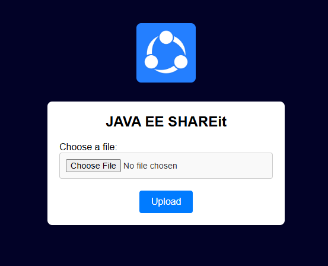

# Java EE SHAREit Web Application

## Overview
Java EE SHAREit is a simple file-sharing web application developed using Java EE. It allows devices connected to the same local network to share files seamlessly. This application leverages localhost for hosting, ensuring a lightweight and efficient solution for small-scale file sharing.

---

## Features
- **File Sharing:** Share files across devices connected to the same network.
- **User-Friendly GUI:** An intuitive graphical interface for easy navigation.
- **Lightweight:** Designed to operate on a local network using localhost.

---

## Getting Started

### Prerequisites
- Java Development Kit (JDK) 8 or later
- Java EE-compatible application server (Apache Tomcaty)
- Local network (LAN/Wi-Fi)

## Usage
1. Open the application in your browser.
2. Select the file you want to share.

---

## Screenshots
### GUI Sample:

---

Happy Sharing!
